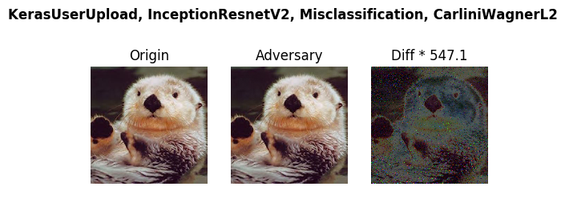

# Use Case 1 Prepare InceptionResNetV2 Keras Model

The model we try to evaluate is [InceptionResNetV2](https://github.com/yuyang-huang/keras-inception-resnet-v2) obtained from a github repo. Instead of loading the pretrained model from keras.applications.inception_resnet_v2, we load the model from scratch with a weight file containinng the latest trained parameters.

Step 1 -- Clone perceptron robustness benchmark
```bash
git clone https://github.com/advboxes/perceptron-benchmark.git
cd perceptron-benchmark
nvidia-docker build -t perceptron:env ./
nvidia-docker run -i -t --rm -d --name perceptron percetron:env bash
nvidia-docker exec -ti perceptron bash
```  

Step 2 -- Set up InceptrionResNetV2
Inside the docker container
Clone tensorflow-model repo
```bash
git clone https://github.com/tensorflow/models.git
export PYTHONPATH=/perceptron/models/research/slim
```
Install tf-slim
```bash
pip install tf-slim
```

Clone keras inception resnet v2 repo
```bash
git clone https://github.com/yuyang-huang/keras-inception-resnet-v2.git
mv keras-inception-resnet-v2 keras_inception_resnet_v2

cd keras_inception_resnet_v2
```

Extract/Load/Generate weights
```bash
python extract_weights.py
python load_weights.py
```

The  model files are generated in ./model. To test the model run the following command
```bash
python test_inception_resnet_v2.py
```
The returned results shall look like this.
```
elephant.jpg class=386 prob=0.7856153249740601
elephant.jpg passed test. (tolerance=1e-05)
```

Now that the model has been set up and function well, let us port it to perceptron-benchmark for robustness evaluation.

Step 3 -- Make InceptionResnetV2 work with Perceptron Benchmark
```bash
cd /perceptron
cd perceptron/models/classification
```
Wrap your model by creating a sub-class of perceptron.models.classification.keras and name it kerasmodelupload.py
```python
from __future__ import absolute_import

from perceptron.models.classification.keras import KerasModel
import json, os

class KerasModelUpload(KerasModel):
    def __init__(self,
                 bounds,
                 channel_axis=3,
                 preprocessing=(0,1),
                 predicts='logits'):
        #load model
        model = self.load_model()

        super(KerasModelUpload, self).__init__(model = model,
                                            bounds=bounds,
                                            channel_axis = channel_axis,
                                            preprocessing=preprocessing,
                                            predicts=predicts)

    def load_model(self):
        '''
        model evaluation participants need to implement this and make sure a keras model can be loaded and fully-functional
        '''
        import keras_inception_resnet_v2.inception_resnet_v2 as keras_irv2

        model = keras_irv2.InceptionResNetV2(weights=None)
        model.load_weights(os.path.join("/perceptron/keras_inception_resnet_v2/models",'inception_resnet_v2_weights_tf_dim_ordering_tf_kernels.h5'))
        return model
```


Run test example keras_userupload_cw.py 
```bash
cd -
python examples/keras_userupload_cw.py
```

The results shall look like
```bash
Summary:
Configuration: --framework KerasUserUpload --model InceptionResnetV2 --criterion Misclassification --metric CarliniWagnerL2
The predicted label of original image is otter
The predicted label of adversary image is weasel
Minimum perturbation required: normalized MSE = 1.95e-07
```
This test will also produce an image in /perceptron/example/images/KerasUserUpload_InceptionResnetV2_Misclassification_CarliniWagnerL2.png




